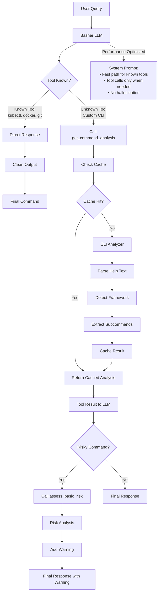

# Basher - Intelligent CLI Command Assistant

## Setup

1. **Install Ollama**
   ```bash
   curl -fsSL https://ollama.com/install.sh | sh
   ```

2. **Create the Model**
   ```bash
   ollama create basher -f Modelfile
   ```

3. **Install Dependencies**
   ```bash
   pip install ollama
   ```

## Usage

Run from the parent directory of the basher package:

```bash
python -m basher "list pods with kubectl"
```

### Options

```bash
python -m basher "query" [--thinking] [--no-progress] [--debug]
python -m basher --analyze <command>
python -m basher --risk <command>
```

- `--thinking` - Show AI thinking process
- `--no-progress` - Disable progress indicators  
- `--debug` - Show debug logging

## Examples

```bash
# Basic command construction
$ python -m basher "scale deployment to 5 replicas"
kubectl scale deployment/myapp --replicas=5

# With warning for dangerous commands
$ python -m basher "delete all files recursively"
⚠️ Warning: This will permanently delete all files recursively
rm -rf *

# Analyze a specific command
$ python -m basher --analyze kubectl

# Check command risk
$ python -m basher --risk "rm -rf /"
```

## How It Works


